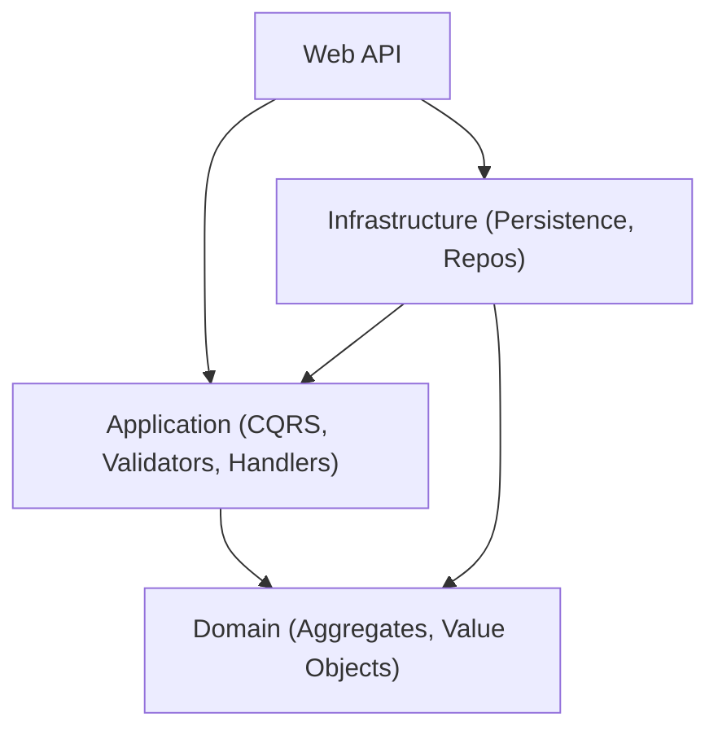
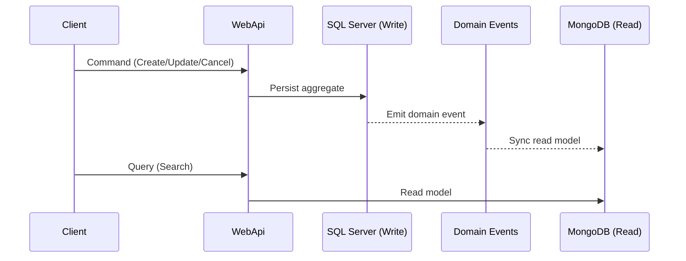

# Order Management API

Clean Architecture + DDD + CQRS Web API for an order management domain. Writes use SQL Server and reads use MongoDB, kept in sync through domain events.

## Environment

- .NET SDK 10.0.101 (see `global.json`)
- .NET Aspire workload (for AppHost orchestration)
- Docker Desktop or another container runtime (Podman, Rancher Desktop, etc.)

## Run with Aspire (recommended)

```bash
dotnet workload install aspire
dotnet run --project src/AppHost
```

Aspire starts SQL Server and MongoDB containers and configures the Web API automatically.

## Main features

- Clean Architecture with clear dependency boundaries
- DDD aggregates: Customer, Product, Order
- CQRS with SQL Server for write and MongoDB for read
- Domain events to sync read models
- Pagination and sorting for search endpoints
- Hashids for external IDs
- ProblemDetails-based error responses
- OpenAPI + Scalar UI (via Aspire)

## Architecture

### Clean Architecture dependencies



### CQRS sync flow



## API overview

- `POST /api/v1/customers`
- `GET /api/v1/customers`
- `POST /api/v1/products`
- `GET /api/v1/products`
- `POST /api/v1/customers/{customerId}/orders`
- `PATCH /api/v1/customers/{customerId}/orders/{orderId}`
- `DELETE /api/v1/customers/{customerId}/orders/{orderId}`
- `GET /api/v1/customers/{customerId}/orders`

## Roadmap: more flexible order editing

- Support item-level patch operations (add, update, remove) with an explicit change set
- Introduce order edit sessions with optimistic concurrency (ETag/version)
- Allow partial price updates with audit trail and reason codes
- Add discount and tax adjustments at item and order level
- Event-sourced audit history for order changes